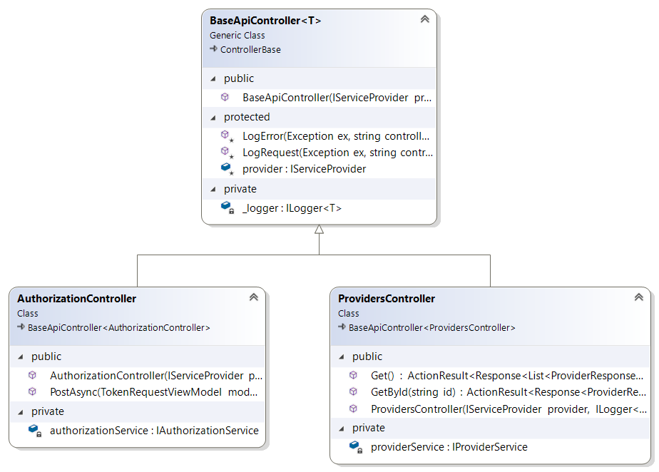
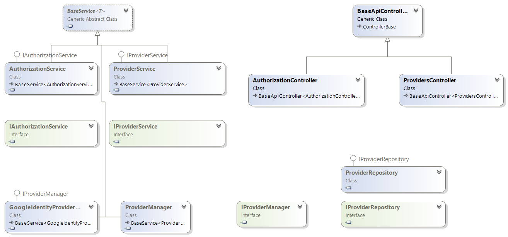

## Project Structure
The project is structured into two API and Service, the API project is the client facing aspect of the project and the service manages the project logic.


## API Project
	- Controllers
	- Middleware

Each controllers inherits from a base controller, that provides common methods for controllers in the API project


##
> Sample Controller Creation
``` c#
    [Route("api/connect")]
    [ApiController]
    [ApiConventionType(typeof(DefaultApiConventions))]
    [Produces("application/json")]
    public class AuthorizationController : BaseApiController<AuthorizationController>
    {
        private IAuthorizationService authorizationService;
        /// <summary>
        /// Default authorization constructor
        /// </summary>
        /// <param name="provider"></param>
        /// <param name="logger"></param>
        /// <param name="authorizationService"></param>
        public AuthorizationController(IServiceProvider provider, ILogger<AuthorizationController> logger, IAuthorizationService authorizationService) : base(provider, logger)
        {
            this.authorizationService = authorizationService;
        }
    }
```
##
> Useful method in base controller
``` c#
    protected void LogError(Exception ex, string controller, string method)
    {
        _logger.LogError(ex, $"Error from Controler: {controller}, Action Method: {method}");
    }

    protected void LogRequest(Exception ex, string controller, string method)
    {
        _logger.LogError(ex, $"Error from Controler: {controller}, Action Method: {method}");
    }
```

## Service Project
	- Data Access
	- Extensions
	- Manager
	- Models
	- Responses
	- Services
	- Utilities
	- ViewModels
	
## Class Diagram


## Service - Data Access Layer
This is the data access layer in the project, it enables communication with the DBRMs(SSQL Server) using [Dapper ORM](https://dapper-tutorial.net/dapper) for easy communication.
There are two folders in the data access folder
- Entities
- Repositories

##### Entities 
These are the table object representions in the project